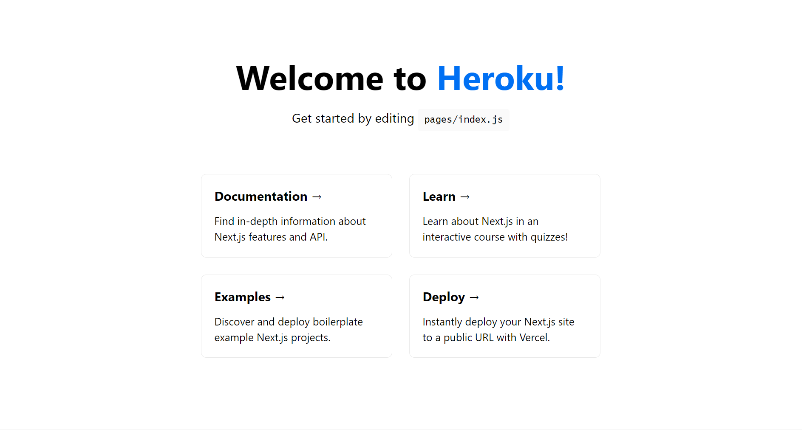

# Next-On-Heroku



If you ever asked if you can deploy a Nextjs outside vercel. Yes, it's damn easy to deploy a Nextjs project on any node hosting provider. Here's an example with heroku.

## Getting Started

Add these two scripts in your package.json:

```json
    "start": "next start -p $PORT",
    "heroku-postbuild": "npm run build"
```

Push to the heroku with its CLI:

```bash
    heroku create your_app_name
    git push heroku main
```

You can edit the pages by modifying `/pages` directory. The page auto-updates as you edit the file.

## Learn More

To learn more about Next.js, take a look at the following resources:

- [Next.js Documentation](https://nextjs.org/docs) - learn about Next.js features and API.
- [Learn Next.js](https://nextjs.org/learn) - an interactive Next.js tutorial.

You can check out [the Next.js GitHub repository](https://github.com/vercel/next.js/) - your feedback and contributions are welcome!

## Deploy on Vercel (Easiest way to host)

The easiest way to deploy your Next.js app is to use the [Vercel Platform](https://vercel.com/import?utm_medium=default-template&filter=next.js&utm_source=create-next-app&utm_campaign=create-next-app-readme) from the creators of Next.js.

Check out our [Next.js deployment documentation](https://nextjs.org/docs/deployment) for more details.
